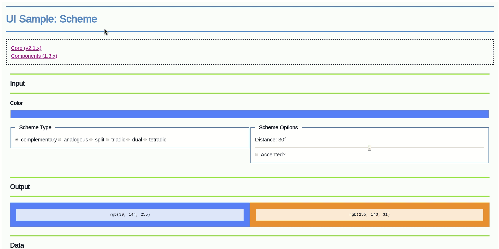
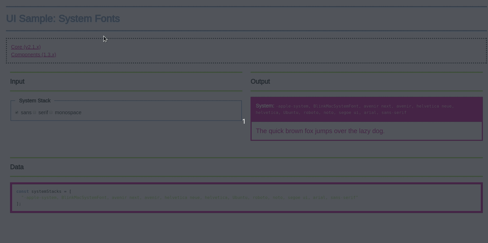

# Quarksuite (Components)

*Quarksuite grew beyond the need for a dedicated UI library or app. It's a toolkit. An app would steal focus from making the kit portable and flexible.*

*You can still browse the code if you want*

This repo contains and documents components for building Quarksuite GUIs. If you want to learn more about what this is and why it exists, please [visit the core repo](https://github.com/quarksuite/core).

## Installation

### As a Module

>You’ll want to grab the latest Node.js LTS (v12.15.0) version if you want to use the library as a module. I recommend installing Yarn as well.

```bash
npm install @quarksuite/components

# OR

yarn add @quarksuite/components
```

Then in your target file:

```js
require('@quarksuite/components');

// OR if using Webpack/Parcel

import '@quarksuite/components';
```

### In the Browser

#### Snowpack

```bash
npm install @quarksuite/components

# OR

yarn add @quarksuite/components
```

```bash
npx snowpack
```

```html
<html lang="en">
  <head>
    <meta charset="utf-8">
    <meta name="viewport" content="width=device-width">
    <title>Quarksuite Components (v1.3.x) Example</title>
  </head>
  <body>
    <script type="module" src="/index.js"></script>
  </body>
</html>
```

```js
import '/web_modules/@quarksuite/components.js';
```


#### Unpkg

```html
<html lang="en">
  <head>
    <meta charset="utf-8">
    <meta name="viewport" content="width=device-width">
    <title>Quarksuite Components (v1.3.x) Example</title>
  </head>
  <body>
    <script src="https://unpkg.com/@quarksuite/components@v1.4.0/dist-web/index.bundled.js"></script>
  </body>
</html>
```

## UI Samples

Below are some rough examples of how the core and components work together to create, display, and capture baseline data.

### Color

#### [Custom Palette](https://color-ui-sample-custom.now.sh)


#### [Basic Color Scheme](https://color-ui-sample-scheme.now.sh)



#### [Color Variants](https://color-ui-sample-variants.now.sh)


### Content

#### [System Font Stacks](https://font-ui-sample-system.now.sh)



#### [Modular Scale](https://font-ui-sample-scale.now.sh)


### Proportion

#### [Modular Scale](https://proportion-ui-sample-scale.now.sh)


## API

See the [API documentation](API.md).
