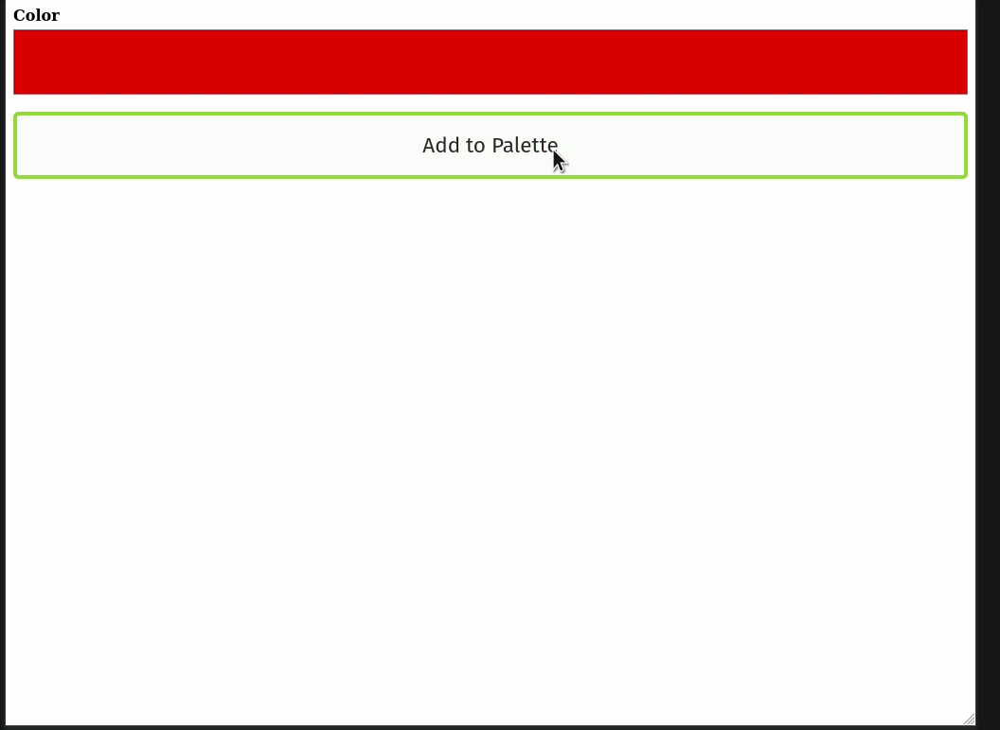
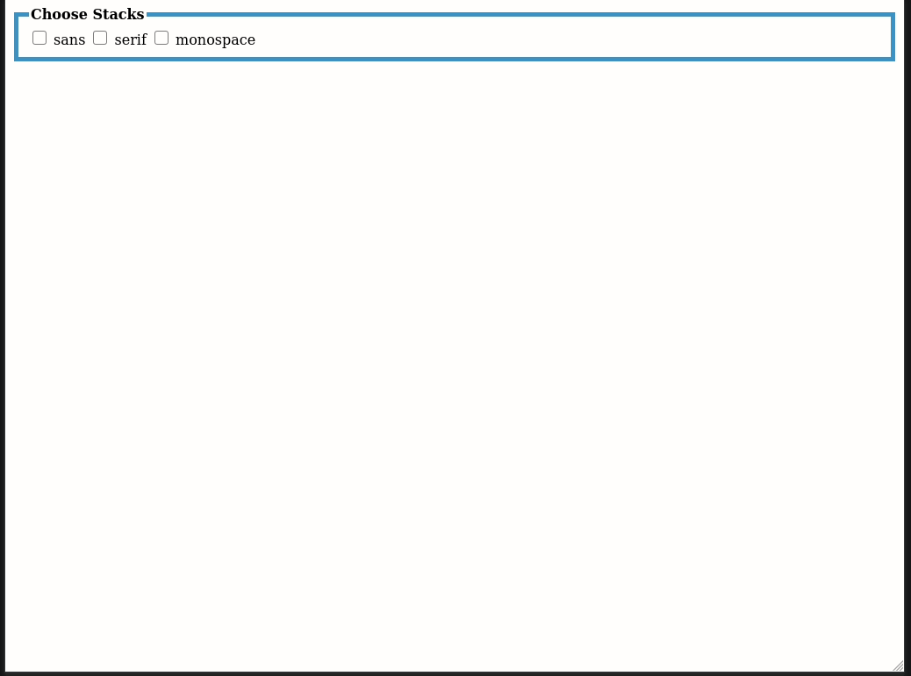
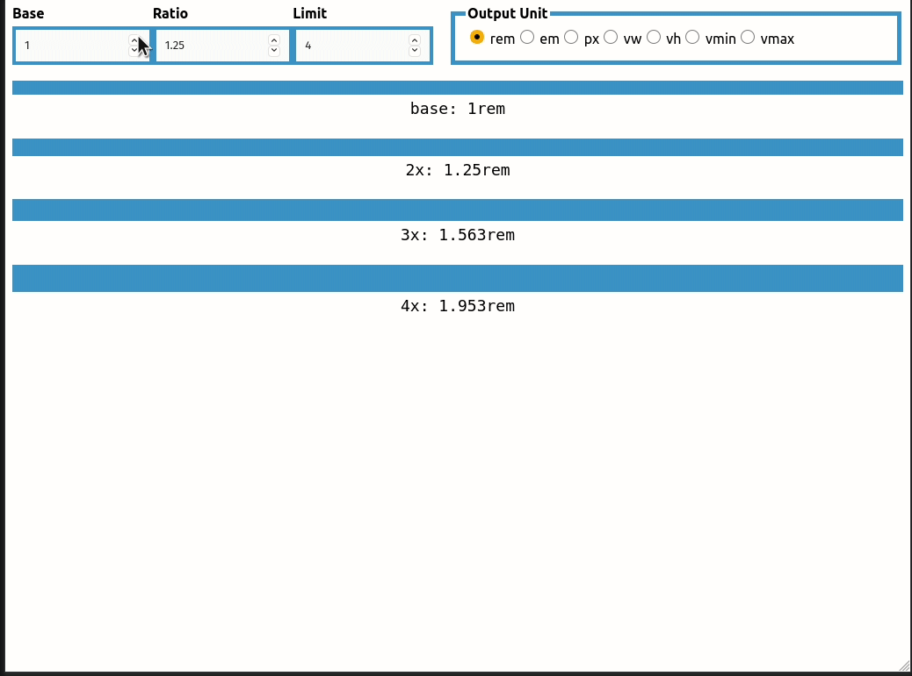

# Quarksuite (Components)

This package contains and documents components for building an upcoming GUI. The plan is to use [Electron](https://www.electronjs.org/) and keep it as small and light as possible. The component demos may not match the current design later. If you want to learn more about the what and why of the Quarksuite project, please [visit the core repo](https://github.com/quarksuite/core).

## Components (as of v0.2.0)

### \<qsui-custom>

The skeleton for an interface that allows custom palette creation.

#### Demo

### \<qsui-dataview>

A display component that accepts Quarksuite data and formats the output.

#### Properties

+ `data: Object = {}`: The data to format
+ `variable: String = 'output'`: The variable to use for the output
+ `filename: String = 'system.js'`: The filename to label the output 

### \<qsui-mix>

The skeleton for an interface that allows a color mixture.

#### Demo

### \<qsui-scheme>

The skeleton for an interface that allows basic color scheme creation.

#### Demo

### \<qsui-sysfonts>

The skeleton for an interface that allows choosing system font stacks

#### Demo

### \<qsui-proportion>

The skeleton for an interface that creates spacing and proportion values.

#### Demo

### \<qsui-content>

The skeleton for an interface that creates a modular scale for content.

#### Demo

